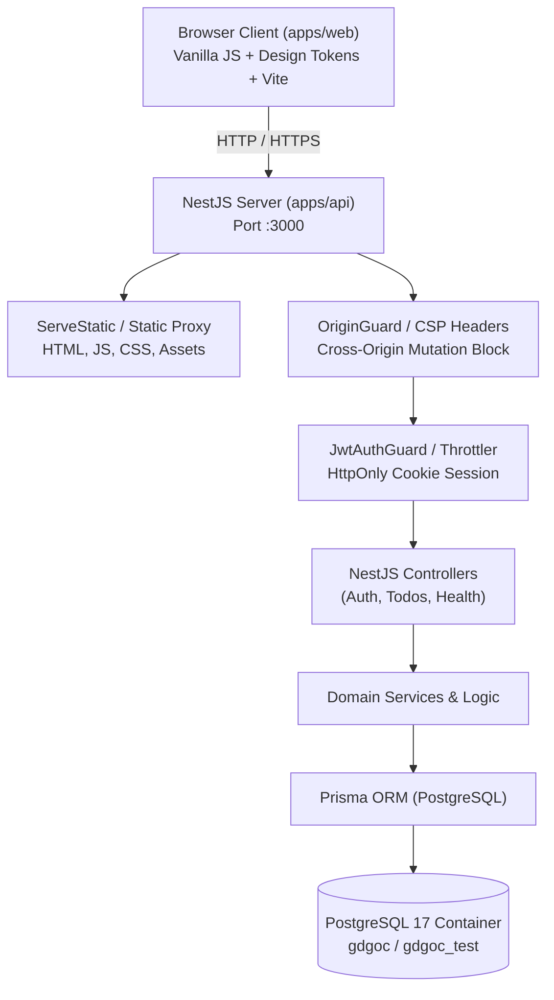
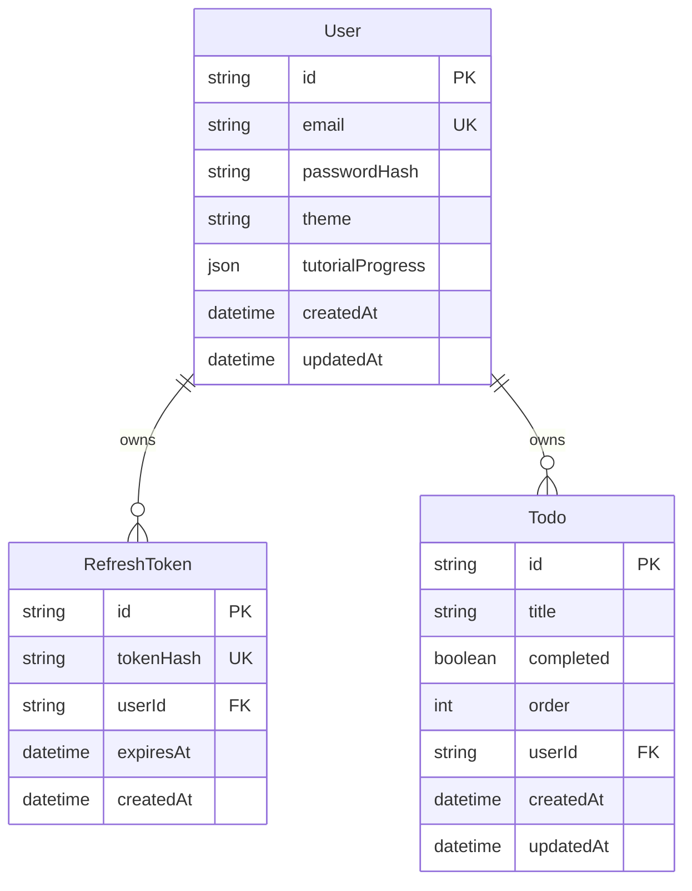
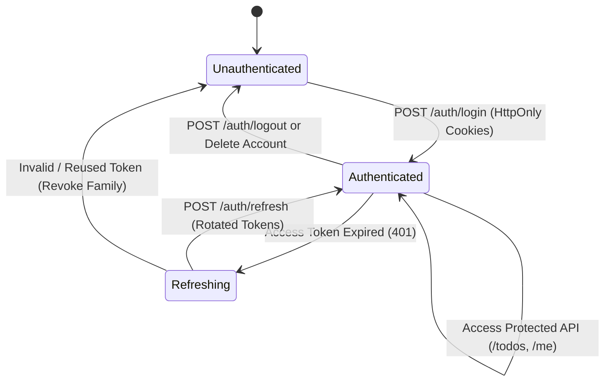

# GDGoC UNAIR Web-Dev — Production Platform & Architecture

Production-grade full-stack web application and interactive web development curriculum platform developed for Google Developer Groups on Campus (GDGoC) Universitas Airlangga.

---

## 1. System Architecture & High-Level Design

The repository is structured as a TypeScript monorepo with strict separation of concerns, end-to-end type safety, and zero-trust security boundaries:



### Monorepo Workspaces
- **`apps/web`:** High-performance, frameworkless vanilla JavaScript client. Features accessible WCAG AA design system tokens (`tokens.css`), client-side state synchronization, offline resilience, and sandboxed live tutorial execution.
- **`apps/api`:** Modular NestJS application providing RESTful APIs, cookie-based JWT authentication, rate limiting, and Prisma ORM integration.
- **`packages/contracts`:** Shared Zod schemas and TypeScript interfaces ensuring runtime input validation across frontend and backend.

---

## 2. Core Architectural & Design Principles

### A. Security Architecture & Threat Model
1. **HttpOnly Cookie Authentication:** JWT tokens are stored strictly in `HttpOnly`, `SameSite=Lax`, `Secure` cookies, eliminating XSS token theft vectors.
2. **Refresh Token Family Revocation:** Refresh tokens are hashed using SHA-256 and stored in the database. When token reuse is detected, the entire token family is revoked immediately.
3. **Strict Origin & CSRF Defense:** The `OriginGuard` verifies `Origin` and `Referer` headers on all mutating HTTP methods (`POST`, `PUT`, `PATCH`, `DELETE`), preventing CSRF.
4. **Sandboxed Tutorial Live Edit:** Tutorial code execution is isolated within an iframe sandbox without `allow-same-origin`, preventing script injection from compromising the parent application.
5. **Security Headers & CSP:** Helmet configures strict Content Security Policy (`script-src 'self'`), `frame-ancestors 'none'`, and `X-Content-Type-Options: nosniff`.

### B. Database Schema & ERD


### C. Authentication State Lifecycle


---

## 3. Environment Variables Matrix

| Variable | Required | Default / Example | Purpose & Production Constraints |
|---|---|---|---|
| `NODE_ENV` | No | `development` | Runtime mode (`development`, `production`, `test`). Triggers strict security in production. |
| `PORT` | No | `3000` | Port for the NestJS API HTTP server. |
| `DATABASE_URL` | **Yes** | `postgresql://...` | Connection URL for PostgreSQL. In production, cannot contain default `dev:devpassword`, `127.0.0.1`, or `localhost`. |
| `TEST_DATABASE_URL` | For tests | `postgresql://.../gdgoc_test` | Dedicated PostgreSQL test database URL. Must end with `_test` suffix. |
| `JWT_SECRET` | **Yes** | 32+ char secret | HMAC key for signing JWT tokens. Must be >= 32 characters and cannot match known placeholders. |
| `FRONTEND_URL` | Prod only | `https://yourdomain.com` | Allowed origin for CORS and Origin check. Mandatory in production. |
| `COOKIE_SECURE` | Prod only | `true` (prod) / `false` (dev) | Sets `Secure` flag on authentication cookies. Must be `true` in production. |
| `THROTTLE_LIMIT` | No | `100` | Max requests per minute per IP for global throttler. |
| `AUTH_LOGIN_THROTTLE_LIMIT` | No | `5` | Max login attempts per minute per IP. |
| `POSTGRES_USER` | Docker | `dev` | Database username for Docker Compose service. |
| `POSTGRES_PASSWORD` | Docker | `devpassword` | Database password for Docker Compose service. |
| `POSTGRES_DB` | Docker | `gdgoc` | Database name for Docker Compose service. |

---

## 4. Quick Start (Development)

### Prerequisites
- Node.js 22 LTS
- Docker Desktop (with Docker Compose)

### Setup & Run
```bash
# 1. Clone & install dependencies
npm ci

# 2. Configure environment
cp .env.example .env

# 3. Start PostgreSQL container
docker compose up -d db

# 4. Generate Prisma client & apply database migrations
npx prisma generate --schema=apps/api/prisma/schema.prisma
npx prisma migrate dev --name init --schema=apps/api/prisma/schema.prisma

# 5. Build contracts & workspaces
npm run build

# 6. Start development server
npm run dev
```
Access the application at `http://localhost:3000`.

---

## 5. Testing & Quality Verification Suite

The repository maintains an automated ratchet verification system:
- **Full Test Suite:** `npm test` (syntax check, test DB guard, Vitest API tests, build, and Playwright)
- **API E2E Tests:** `npm run test:e2e --workspace=apps/api`
- **Browser Playwright E2E:** `npx playwright test --repeat-each=3`
- **Accessibility & UI:** Automated WCAG 2.1 AA checks via `@axe-core/playwright`, 320px reflow test, and keyboard walkthrough.
- **Lighthouse Audits:** `node scripts/run-lighthouse.js` (enforces 100 on Performance, Accessibility, Best Practices, SEO).
- **Machine Verifier:** `npm run verify -- --stage <id>` or `npm run verify -- --all`

---

## 6. Docker & Production Deployment

### Multi-Stage Dockerfile
The production `Dockerfile` builds an immutable, hardened container:
- Base: `node:22-alpine`
- Process execution: Non-root user (`USER node`)
- Health check: Configured HTTP probe hitting `/api/v1/health`
- Excludes dev tools and sources via `.dockerignore`

```bash
# Build production web bundle
npm run build --workspace=apps/web

# Build production container image
docker build -t gdgoc-app:latest .

# Run with Docker Compose production profile
docker compose --profile prod-like up -d
```

---

## 7. Disaster Recovery & Rollback Runbook

### Database Backups (`pg_dump`)
```bash
# Export schema & data
docker exec gdgocunairweb-dev-db-1 pg_dump -U dev -d gdgoc > backup.sql

# Restore from backup
docker exec -i gdgocunairweb-dev-db-1 psql -U dev -d gdgoc < backup.sql
```

### Zero-Downtime Rollback Strategy
1. **Schema migrations:** All database schema changes must be additive (backward compatible).
2. **Reverting changes:** Create a compensating migration with `npx prisma migrate dev --name revert_<feature>`, deploy via `npx prisma migrate deploy`, and rollback container image.
